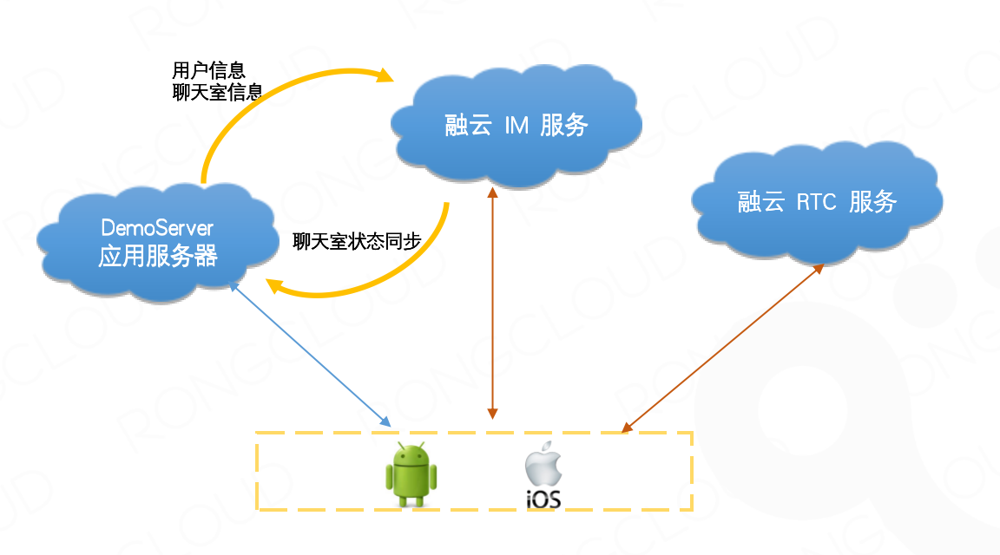
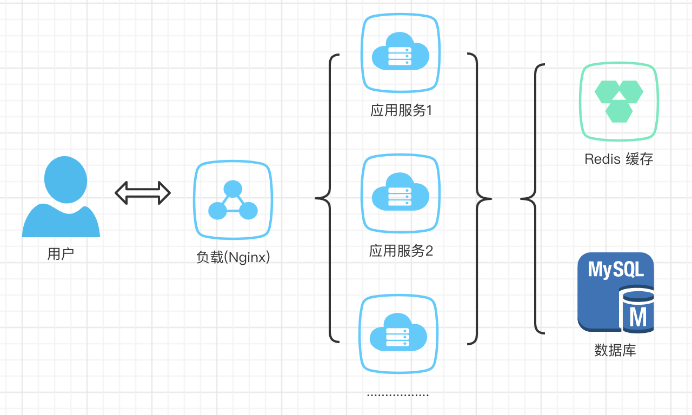
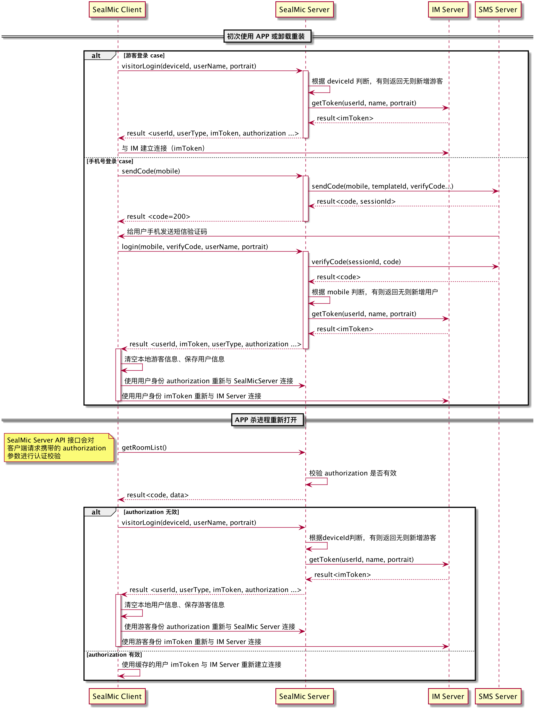
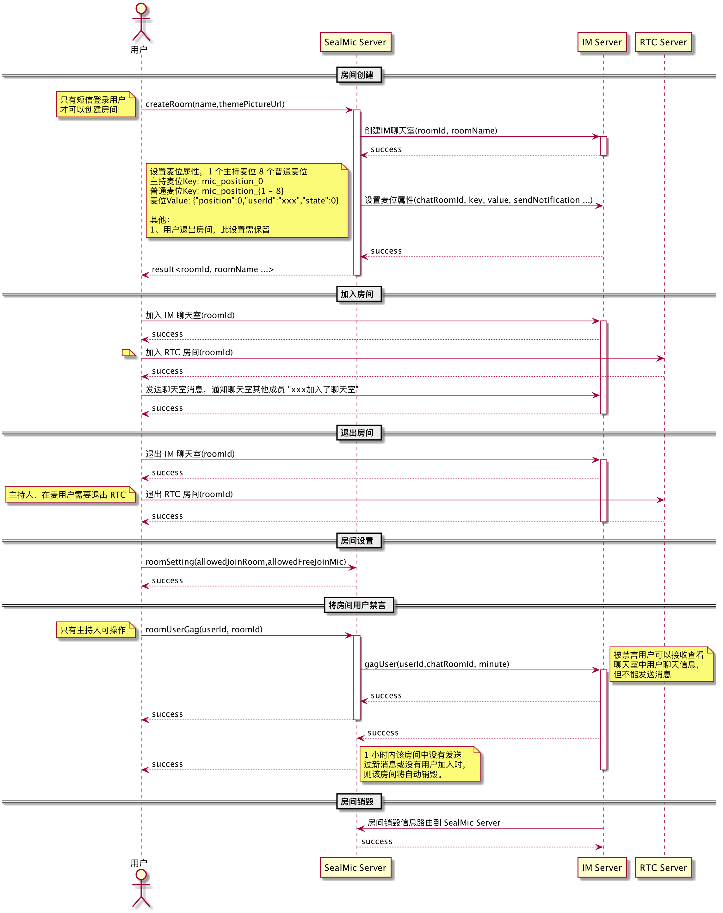
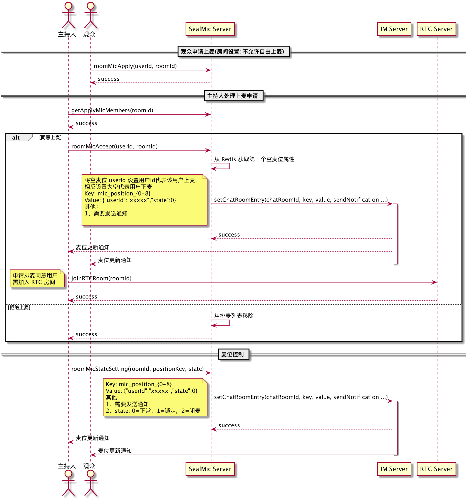
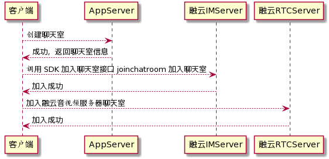
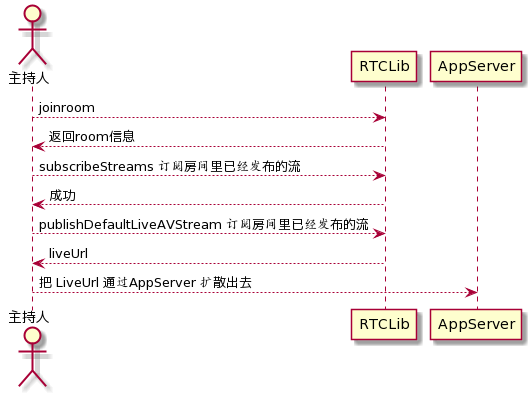
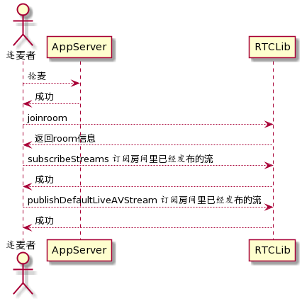
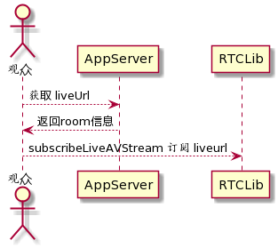

## 项目介绍

### 整体架构


cn.rongcloud-scene-server-bestcase : 应用服务器，负责各种业务数据存储，比如用户、房间、背景音乐、APP版本

IM 服务: 提供 IM 消息分发能力，维持与客户端的连接信息，提供聊天室、消息路由回调等功能

RTC 服务: 提供语音消息能力

## cn.rongcloud-scene-server-bestcase

### 部署架构



cn.rongcloud-scene-server-bestcase 服务无状态，支持水平扩展，通过前置负载均衡实现分布式部署，提升系统吞吐

### 技术栈
* SpringBoot
* SpringDataJpa
* MySQL
* Redis
* Maven
* apidoc
* flyway

### 使用组件
|组件|版本|说明|
|---|---|---|
|Mysql|5.6+|业务数据，存储用户、房间、音乐、APP 版本等信息|
|Redis|4.0+|缓存数据库，缓存用户、房间、排麦用户、麦位等频繁访问的信息|
|Jdk|1.8|Java 版本|
|Nginx|1.13 + | 负载，也可替换为其他负载|

### 角色划分

|角色|说明|
|---|---|
|用户|创建房间需用户权限、上麦等高级功能|
|游客|只能进入已有房间，无法上麦 |

### 接口约定

#### 接口请求
部分接口需要校验登录状态，需要在请求 Header 中携带 Authorization 字段 ，利用JWT自己的验证机制，优点：去中心化，无需特殊验证有效性，缺点：无法踢出用户登录

#### 接口响应
* 响应如果携带有数据，则在HTTP Response Body里使用JSON格式携带，且HTTP响应的Content-Type为 application/json;charset=utf-8。
```
{
  "code": 10000,
  "msg": "success",
  "data": {
    "id": "1",
    "name": "房间名称",
    "theme_picture_url":""
  }
}
```
 * 响应中，通过code标识业务上是否成功失败，该参数是必选
 * 响应中，通过msg携带一个可读性更强的结果描述字串，该参数是可选的
 * 成功响应中，通过 data 标识真正业务返回的数据
* 如果是比较明显的资源语义错误，则使用HTTP自身错误码(如400, 404, 401等)来标识错误。
* 如果是业务上的错误，则使用JSON结果中的code标识具体错误码，且可能通过'msg'携带一个文本的错误提示，但该提示不是必选的，且不应该用于端上给最终用户的UI提示。示例如下
```
{
  "code": 10101,
  "msg": "Missing or invalid parameter"
}
```
#### 业务接口说明

### 主要场景交互

#### 登录场景交互


#### 房间场景交互


#### 麦位场景交互


### 数据库设计

t_user 表：存储用户基本信息

|字段名|数据类型|长度|主键|允许为空|描述|
|---|---|---|---|---|---|
|id|int|11|是|否|自增id|
|uid|varchar|64|否|否|自定义用户唯一标识|
|name|varchar|64| | |用户名称|
|portrait|varchar|255| | |用户头像|
|mobile|varchar|11| | |手机号|
|type|tinyint|4| | |用户类型，0:注册用户 1:游客 |
|device_id|varchar|64| | |设备ID|
|create_dt|datetime|0| | |创建时间|
|update_dt|datetime|0| | |更新时间|

t_room_mic 表：存储房间基本信息

|字段名|数据类型|长度|主键|允许为空|描述|
|---|---|---|---|---|---|
|id|int|11|是|否|自增id|
|uid|varchar|64|否|否|自定义房间唯一标识|
|name|varchar|64| | |房间名称|
|theme_picture_url|varchar|1024| | |房间主题图片|
|allowed_join_room|boolean|| | | 是否允许观众加入房间 0否1是|
|allowed_free_join_mic|boolean|| | | 是否允许观众自由上麦 0否1是|
|type|tinyint|4| | |房间类型，0:官方房间 1:自建房间 |
|is_private|tinyint|4| | |房间类型：0 普通房间，1 加密房间 |
|password|varchar|255| | |加密房间密码 |
|user_id|varchar|120| | |房间创建人 |
|background_url|varchar|120| | |房间背景图片地址 |
|create_dt|datetime|3| | |创建时间|
|update_dt|datetime|3| | |更新时间|

t_appversion 表：存储APP版本信息

|字段名|数据类型|长度|主键|允许为空|描述|
|---|---|---|---|---|---|
|id|int|11|是|否|自增id|
|platform|tinyint|4| | 否 |1:Android, 2:iOS|
|download_url|varchar|255| |否 |下载地址|
|version|varchar|36| | 否| 版本号|
|version_code|varchar|36| | 否| 版本标识|
|force_upgrade|boolean| | | | 是否强制更新|
|release_note|text| | | | 版本描述|
|create_dt|datetime|3| | |创建时间|
|update_dt|datetime|3| | |更新时间|

t_room_music 表：存储房间背景音乐

|字段名|数据类型|长度|主键|允许为空|描述|
|---|---|---|---|---|---|
|id|int|11|是|否|自增id|
|name|varchar|64| | 否 |音乐名称|
|author|varchar|50| | |作者|
|room_id|varchar|64| | 否| 对应房间ID|
|type|tinyint|4| | 否| 音乐类型：0 官方音乐，1用户上传,3 从官方添加|
|url|varchar|1024 | | | 音乐地址|
|size|int|5 | | | 音乐大小 KB|
|sort|int|5 | | | 排序 |
|create_dt|datetime|3| | |创建时间|
|update_dt|datetime|3| | |更新时间|

## client
### 客户端进入房间流程

### 主持人上麦主要交互

### 抢麦流程

### 观众进入流程


## 主要信令定义
### room 相关信令
|消息名称|类型|objectName|content|描述|
|---|---|---|---|---|
|SMUserJoinMessage|存储不计数|SM:UserJoin|type:角色，extra|用户加入的通知|
|SMUserLeftMessage|存储不计数|SM:UserLeft|extra|用户离开的通知|
|SMRoomDestroyMessage|不存储不计数|SM:RoomDst|extra|聊天室销毁的通知|
|SMUserSpeakingMessage|不存储不计数|SM:UserSpk|audioLevel,extra|用户说话的通知|
